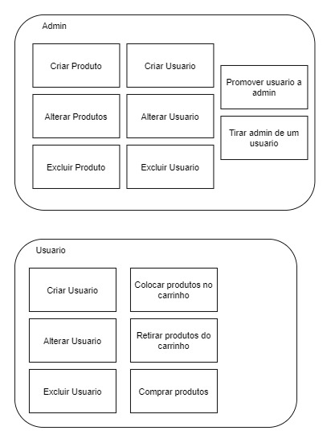

#  SCC0219 - Web Development
## Gourmet coffee shop 
Online shop website, that contains products of coffee. The application suports two types of users: admin (to manage products, promotions and other users) and clients (that can buy products and add their favorite to cart).  
The specific application for this kind business is { we don't have yet }

## Group:
* Danilo Silva 
* Jean Carlos
* Lucas Braga

## Requirements:
* The system must have 2 types of users: Clients and Administrators.
  * Administrators are responsible for registering/managing administrators, customers, and products/services provided. The application already comes with an account admin with password admin.
  * Customers are users who access the system to buy products/services.
* The admin record includes: name, id, phone, email.
* Each customer's record includes, at least: name, id, address, phone, email
* Product/services records include, at least: name, id, photo, description, price, quantity (in stock), quantity sold.
* Your store may sell products, services or both (you decide).
* Selling Products (or services): Products are selected, their quantity chosen, and are included in a cart. Products are purchased using a credit card number (any number is accepted by the system). The quantity of product sold is subtracted from the quantity in stock and added to the quantity sold. Carts are emptied only on payment or by customers.
* Product/Service Management: Administrators can create/update/read/delete (crud) new products and services. For example, they can change the stock quantity.
* Your functionality: Create a functionality that is specific to your application. It does not have to be something complicated. For instance, if you are selling cars, you may allow users to use an accelerator to hear how each car engine roars up and down.
* The system must provide accessibility requirements and provide good usability. The system must be responsive.

## Project Description:

The following diagram shows how our website works:

Diagrama: 

#### Main Page
The main page is responsive.

#### User Page
In the user page, the user can view their information, log out from their acconut or delete their account.

#### Login Page
In this page the user can login the website's system. After connected the user will be redirected to the main page, if logged with a client account, or to admin page if logged with an admin account. 
If the user doesn't have a registered account, he can access the register page from this page. 

##### Login as Admin (mocked)
Login: admin  
Password: admin

##### Login as regular user (mocked)
Login: user  
Password: user  

#### Products Page
This page shows all the products available in our online shop. If an administrator adds a new product or edits an already existing one, the products page will be updated.
This page also presents our group's functionality { we don't have yet }.

#### Cart and Payments Page
This page displays all the products selected by the user. It's possible to change the desired quantity of each product, as well as remove them.  After the user is done with shopping, they can go to the payment page, where they'll fill in the forms with shipment and payment information. After the payment is concluded, the user is redirected to the main page. 

#### Admin's Page (we didn't make the prototype)
In this page the admin will can manage the available products or the users that are registered on the plataform. He can turn a normal user (client) into a new administrator. He could also add new products or edit the already existing ones.
 
## Comments About the Code:

In this project, HTML5, CSS3, Bootstrap, JavaScript ...

## Test Plan:

Our tests will be done manually. 

## Test Results:

We performed multiples tests in our system and ...

## Build Procedures:

Access HTML page

## Problems:

Until now, we haven't had

## Comments:

Until now, we haven't had
